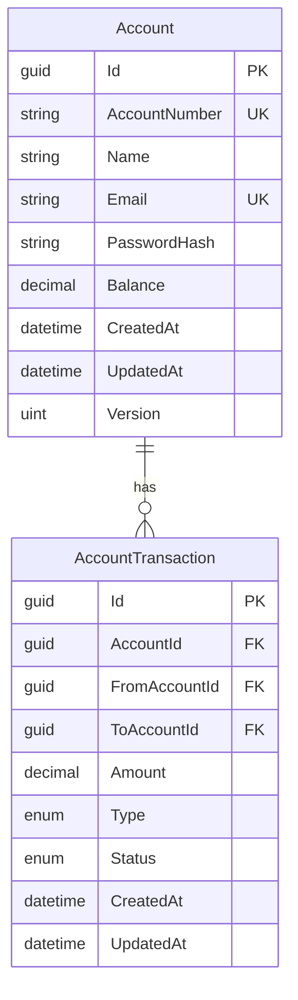
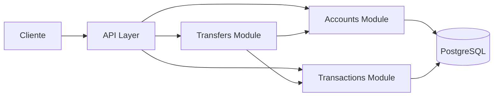

# Banking API

Uma API bancária simples construída com .NET 10 para gerenciamento de contas e transferências de dinheiro.

## Funcionalidades

- **Gerenciamento de Contas** - Cadastro, login, visualização de detalhes da conta
- **Depósitos e Saques** - Adicionar ou retirar fundos das contas
- **Transferências** - Transferir dinheiro entre contas
- **Histórico de Transações** - Visualizar todas as transações da conta
- **Controle de Concorrência** - Bloqueio otimista para prevenir condições de corrida
- **Autenticação JWT** - Endpoints de API seguros

## Tecnologias

- **.NET 10** - Web API
- **PostgreSQL** - Banco de dados
- **Entity Framework Core** - ORM
- **Docker** - Containerização
- **xUnit** - Testes unitários
- **Swagger** - Documentação da API

## Arquitetura

O projeto segue uma arquitetura de **monolito modular** com separação clara de responsabilidades:
```
src/
├── Api/                          # Camada de API (Controllers, DTOs)
├── Accounts/
│   ├── Accounts.Domain/          # Entidades, interfaces de repositório
│   ├── Accounts.Application/     # Serviços, lógica de negócio
│   └── Accounts.Infrastructure/  # EF Core, implementações de repositório
├── AccountTransactions/
│   ├── AccountTransactions.Domain/
│   ├── AccountTransactions.Application/
│   └── AccountTransactions.Infrastructure/
├── Transfers/
│   ├── Transfers.Application/
│   └── Transfers.Infrastructure/
└── Shared/                       # Contratos compartilhados, exceções
```

---

### Diagrama de Entidades


### Arquitetura do Sistema

---

## Decisões de Design

### Monolito Modular
Escolhido uma arquitetura de monolito modular para manter a simplicidade de deployment enquanto mantemos uma separação clara de responsabilidades. Cada módulo (Accounts, AccountTransactions, Transfers) pode ser extraído para um microserviço no futuro, se necessário.

### Simplificação de Entidades
A decisão de manter informações de usuário (nome, email) junto das informações de conta foi proposital. Em um sistema bancário real, seria comum separar `User` e `Account` para permitir:
- Um usuário com múltiplas contas
- Contas conjuntas (múltiplos usuários, uma conta)
- Diferentes tipos de conta (corrente, poupança)

Para este projeto, a simplicidade foi priorizada, evitando complexidade desnecessária para o escopo proposto.

### Decimal para Valores Monetários
Utilização de `decimal` ao invés de `float` ou `double` para evitar erros de arredondamento em cálculos financeiros. O PostgreSQL armazena como `NUMERIC(18,2)`.

### Controle de Concorrência Otimista
Implementação de controle de concorrência usando um campo `Version` que é incrementado a cada atualização. Isso previne condições de corrida em operações simultâneas na mesma conta.

### Transações Duplicadas para Transferências
Cada transferência cria duas transações (TransferOut e TransferIn) para que cada conta tenha seu histórico completo de movimentações, facilitando auditoria e consultas.

### Autenticação JWT
Utilização de JWT (JSON Web Tokens) para autenticação stateless, permitindo escalabilidade horizontal da API sem necessidade de sessões compartilhadas.

## Melhorias Não Implementadas

Por simplicidade e limitação de tempo, algumas funcionalidades recomendadas para produção não foram implementadas:

### Cache

Não há cache implementado. **Redis** pode ajudar a melhorar performance em consultas de informações frequentes:
- Consulta de dados de conta (nome, email, número da conta)
- Histórico de transações (com invalidação a cada nova transação)
- Validação de tokens JWT

### Rate Limiting

Não há limitação de requisições, o que expõe a API a riscos:
- Endpoints públicos (`/login`, `/register`) vulneráveis a ataques de força bruta
- Possibilidade de sobrecarga do banco com requisições repetidas
- Sem proteção contra abuso por automação

## Começando

### Pré-requisitos

- [.NET 10 SDK](https://dotnet.microsoft.com/download)
- [Docker](https://www.docker.com/get-started) (opcional)
- [PostgreSQL](https://www.postgresql.org/) (se não usar Docker)

### Executando com Docker

1. Clone o repositório:
```bash
   git clone https://github.com/akjpeg/banking-api.git
   cd banking-api
```

2. Crie o arquivo `.env` a partir do exemplo:
```bash
   cp .env.example .env
```

3. Inicie a aplicação:
```bash
   docker-compose up --build
```

4. Acesse a API:
    - API: http://localhost:5000
    - Swagger: http://localhost:5000/swagger

## Endpoints da API

### Autenticação

| Método | Endpoint | Descrição |
|--------|----------|-----------|
| POST | `/api/accounts/register` | Cadastrar uma nova conta |
| POST | `/api/accounts/login` | Login e receber token JWT |

### Operações de Conta

| Método | Endpoint | Descrição |
|--------|----------|-----------|
| GET | `/api/accounts/me` | Obter detalhes da conta atual |
| GET | `/api/accounts/me/balance` | Obter saldo atual |
| GET | `/api/accounts/me/transactions` | Obter histórico de transações |
| POST | `/api/accounts/me/deposit` | Depositar fundos |
| POST | `/api/accounts/me/withdraw` | Sacar fundos |

### Transferências

| Método | Endpoint | Descrição |
|--------|----------|-----------|
| POST | `/api/transfers` | Transferir dinheiro para outra conta |

### Administração

| Método | Endpoint | Descrição |
|--------|----------|-----------|
| GET | `/api/admin/accounts` | Obter todas as contas |
| GET | `/api/admin/accounts/{id}` | Obter conta por ID |
| DELETE | `/api/admin/accounts/{id}` | Deletar conta |

## Exemplos de Uso

### Cadastro
```bash
curl -X POST http://localhost:5000/api/accounts/register \
  -H "Content-Type: application/json" \
  -d '{
    "name": "João Silva",
    "email": "joao@exemplo.com",
    "password": "SenhaSegura123"
  }'
```

### Login
```bash
curl -X POST http://localhost:5000/api/accounts/login \
  -H "Content-Type: application/json" \
  -d '{
    "email": "joao@exemplo.com",
    "password": "SenhaSegura123"
  }'
```

### Depósito
```bash
curl -X POST http://localhost:5000/api/accounts/me/deposit \
  -H "Content-Type: application/json" \
  -H "Authorization: Bearer SEU_TOKEN_JWT" \
  -d '{
    "amount": 100.00
  }'
```

### Transferência
```bash
curl -X POST http://localhost:5000/api/transfers \
  -H "Content-Type: application/json" \
  -H "Authorization: Bearer SEU_TOKEN_JWT" \
  -d '{
    "toAccountNumber": "123456",
    "amount": 50.00
  }'
```

## Executando Testes
```bash
# Executar todos os testes
dotnet test

# Executar com verbosidade
dotnet test --verbosity normal

# Executar projeto específico
dotnet test tests/Accounts.Domain.Tests
```

## Estrutura do Projeto
```
Banking/
├── src/
│   ├── Api/                              # Web API
│   ├── Accounts/                         # Módulo de contas
│   ├── AccountTransactions/              # Módulo de transações
│   ├── Transfers/                        # Módulo de transferências
│   └── Shared/                           # Componentes compartilhados
├── tests/
│   ├── Accounts.Domain.Tests/
│   ├── Accounts.Application.Tests/
│   ├── AccountTransactions.Domain.Tests/
│   ├── AccountTransactions.Application.Tests/
│   └── Api.Tests/
├── docker-compose.yml
├── .env.example
└── BankingApi.sln
```

## Configuração

### Variáveis de Ambiente

| Variável | Descrição | Padrão |
|----------|-----------|--------|
| `POSTGRES_HOST` | Host do banco de dados | `localhost` |
| `POSTGRES_USER` | Usuário do banco de dados | `postgres` |
| `POSTGRES_PASSWORD` | Senha do banco de dados | `postgres` |
| `JWT_KEY` | Chave de assinatura JWT | - |
| `JWT_ISSUER` | Emissor do JWT | `BankingApi` |
| `JWT_AUDIENCE` | Audiência do JWT | `BankingApi` |
